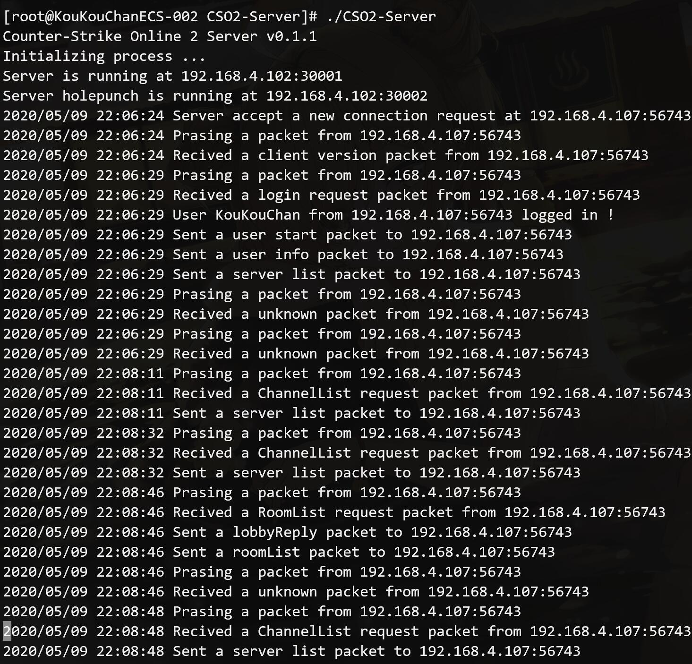
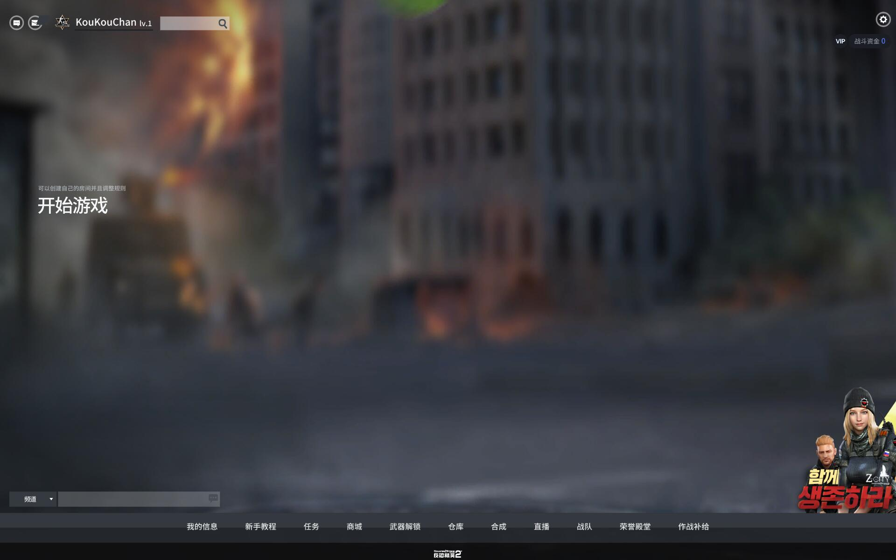
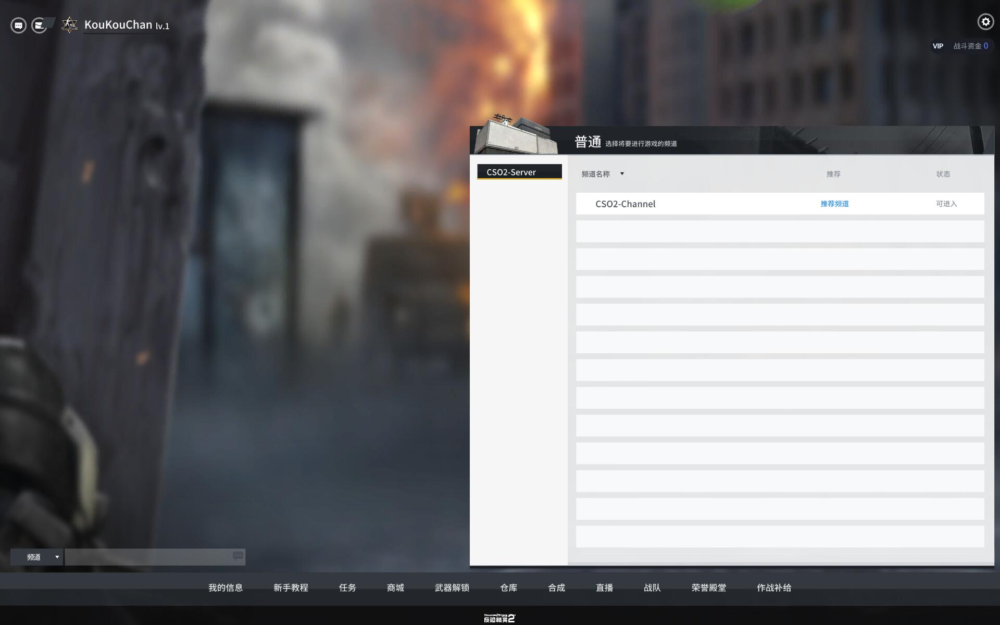

# CSO2-Server

### Description

Counter-Strike Online 2 Server

*It is my first Golang project , in order to practice myself.***

***This project is incomplete right now !***

***Refer to the code of l-leite.***

### Build

    1. enter the folder
    2. use "go build" command to build
    3. run it

### env

    Go 1.14.2
    Use port:30001、30002

***If you want to set up LAN or extranet server, please open the port of firewall.***
