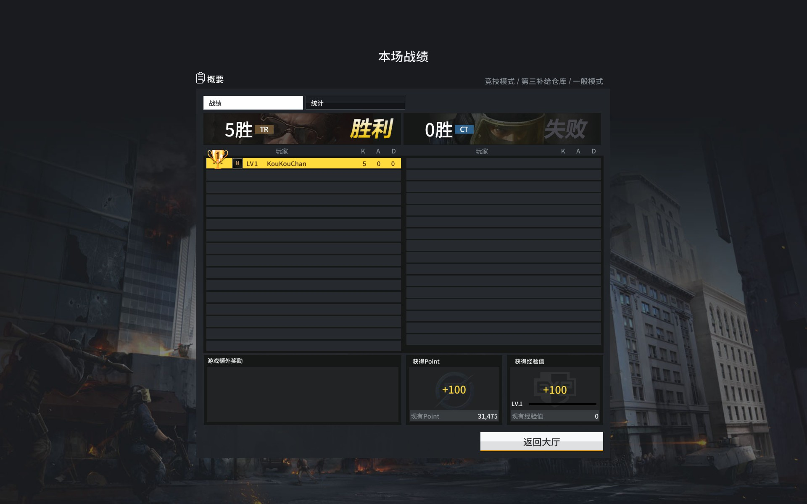

## Counter-Strike Online 2 Server 

### Description

Counter-Strike Online 2 Server

*It is my first Golang project , in order to practice myself.*

***This project is incomplete right now !***

***Referred to the code of l-leite.***

### Build

    1. open the folder
    2. enter "go build" command to build
    3. run it

### env

    Go 1.14.2
    Use port:30001-TCP、30002-UDP

***If you want to set up a LAN or Internet Server, please open the port of firewall.***
