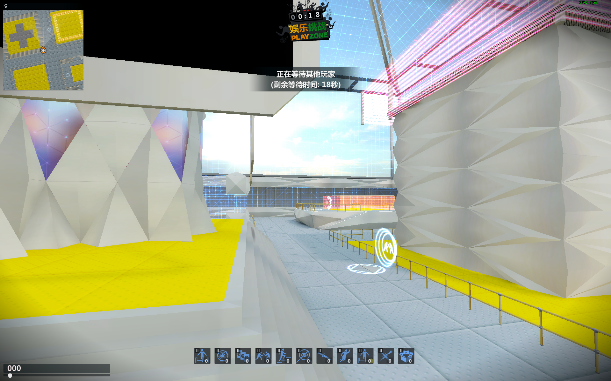

# CSO2-Server

### 介绍

CSOL2 服务器

*用于NEXON的 Counter-Strike Online 2*

这是我的第一个Go语言项目，用来练习。参考了L-Leite大佬的基于nodejs的代码。

### 已完成的功能

    登录、频道

### 正在进行的功能

    房间、仓库、UDP

### 环境

*Go 1.14.2*

***当你要架设局域网或外网时，请打开防火墙的端口。***

### 编译方法

    1. 进入目录
    2. 执行命令 go build
    3. 运行生成的可执行文件即可
