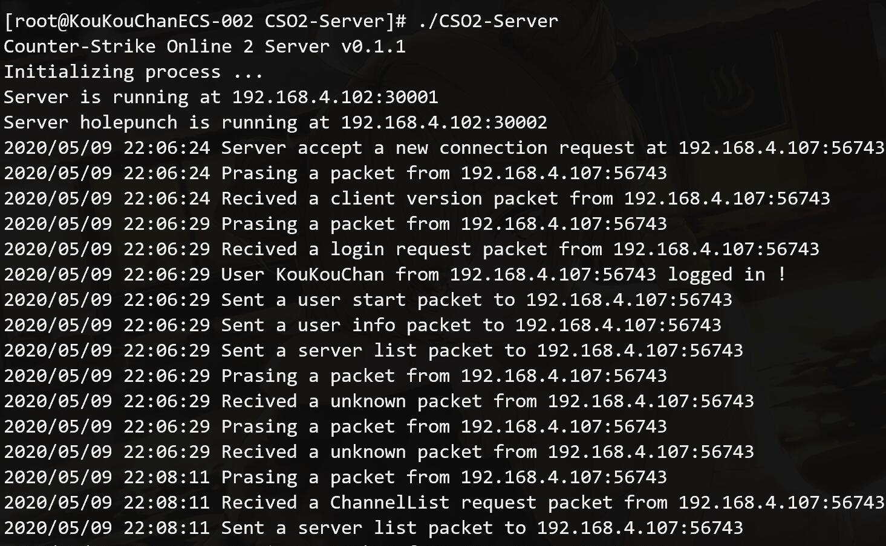
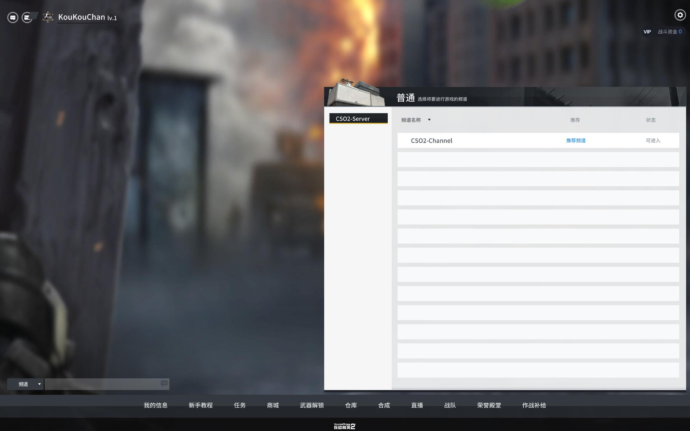
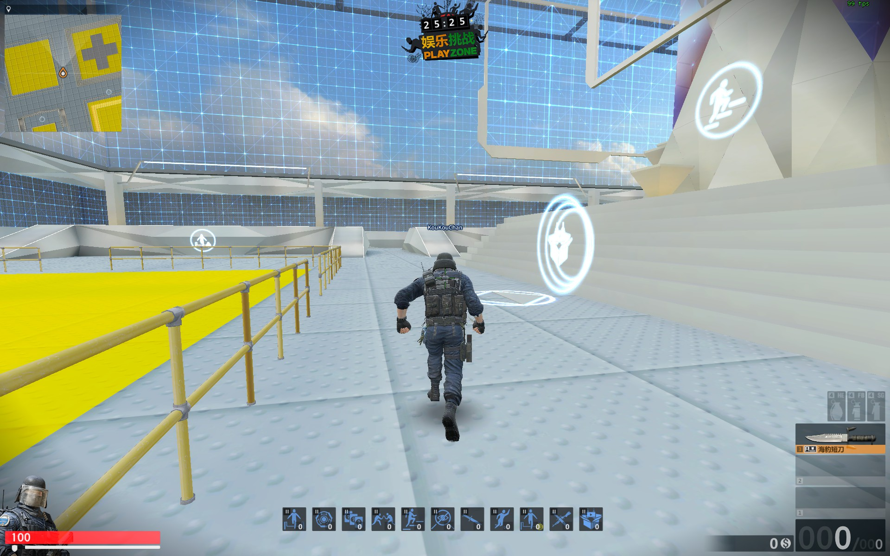

# CSO2-Server

### 介绍

CSOL2 服务器

*用于韩版 Counter-Strike Online 2*

本程序的目标是能够实现一个频道支持局域网(LAN)嗅探，同时另一个频道支持互联网(Internet)互联，基于服务端中继。

目前客户端请暂时使用L-Leite的启动器，可能以后会补上。

这是我的第一个Go语言项目，用来练习，不知道会不会弄下去，参考了L-Leite的数据结构。

如果大家有什么建议或问题，欢迎提出。

### 项目计划

    1.先实现基本的游戏游玩功能和联机功能 ...(进行中)
    2.添加局域网频道和局域网搜索联机功能
    3.添加互联网频道，通过连接互联网主服务器，获取其他用户的服务器，类似CS1.6的互联网
    4.制作启动器，同时与服务器连接获取反馈，例如登录失败、当前用户已登录等
    5.添加仓库管理器，管理自己的武器

### 基本已完成的功能

    登录、频道、UDP

### 正在编写的功能

    房间、仓库、数据库

### 已知问题,优先修复靠前的BUG

    1.房间列表显示的房间信息及状态不准确，待刷新
    2.房间无法加密码
    3.玩家仓库数据不准确

### 已修复的问题

    1.主机开始游戏后，其他玩家不能加入，显示超时。需要和主机一起开始游戏才能加入。

### 环境

*Go 1.14.2*

当你要架设局域网或外网时，请打开防火墙的端口。

### 编译方法

    1. 进入目录
    2. 执行命令 go build
    3. 运行生成的可执行文件即可

*声明：Counter-Strike Online 2 归NEXON所有*
